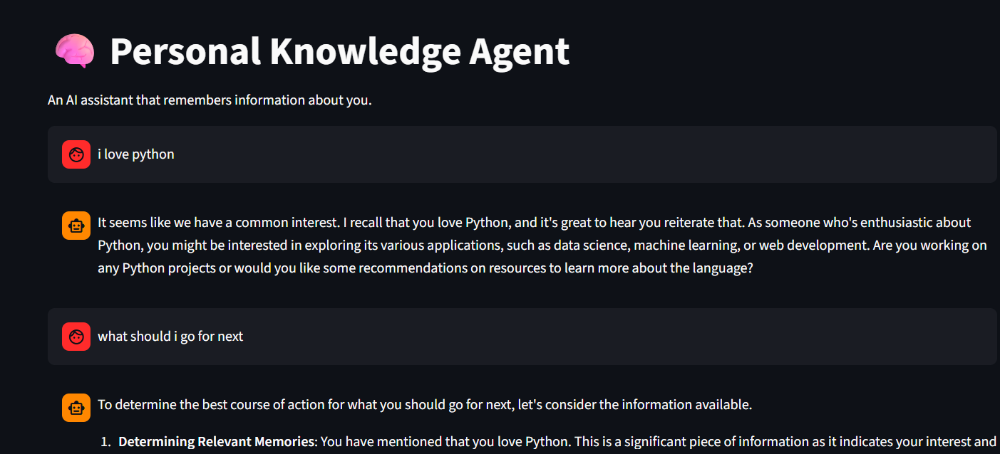
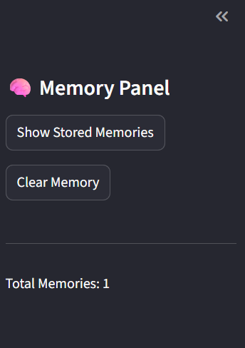
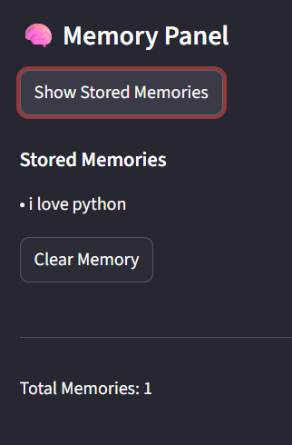

# 🧠 Personal Knowledge Agent

> An agentic AI system that **remembers you** — powered by ChromaDB, Sentence Transformers, and a Groq-hosted LLM, deployed on Streamlit Cloud.

[](https://personal-knowledge-agent.streamlit.app/)
[](https://www.python.org/downloads/release/python-3110/)
[](https://opensource.org/licenses/MIT)
[](https://www.trychroma.com/)

---

## 📖 Overview

**Personal Knowledge Agent** is a production-grade, agentic AI assistant that builds a **persistent memory** of the user over time. Unlike standard chatbots that forget every conversation, this agent continuously learns from user inputs — storing facts, preferences, and context in a local vector database — and uses them to generate **memory-aware, contextually intelligent responses**.

This project is an excellent learning resource for anyone exploring:

- **Agentic AI systems** and retrieval-augmented generation (RAG)
- **Persistent memory** architectures using vector databases
- **LLM orchestration** with LangChain and Groq
- **Semantic search** with Sentence Transformers and ChromaDB
- **Streamlit** for building production AI interfaces

The system is fully deployed on **Streamlit Cloud** with persistent storage backed by **ChromaDB**, making it accessible from any browser without local setup.

---

## ✨ Features

- 🧠 **Persistent Memory** — Remembers user inputs across sessions using ChromaDB as a long-term vector store
- ⭐ **Importance-Based Storage** — Assigns and stores an importance score with each memory for smarter prioritization
- 🔍 **Semantic Memory Retrieval** — Retrieves the most relevant memories using embedding similarity and importance ranking
- 💬 **Memory-Aware Responses** — Injects retrieved context into the LLM prompt for grounded, personalized replies
- 🖥️ **Chat Interface** — Clean, conversational UI built with Streamlit's native chat components
- 📋 **Memory Viewer Panel** — Sidebar panel displaying all stored memories with their importance scores
- 🗑️ **Clear Memory Option** — One-click button to wipe all stored memories and start fresh
- 📊 **Relevance + Importance Ranking** — Retrieved memories are ranked by a combination of semantic similarity and stored importance weight

---

## 🏗️ Architecture & Components

The system follows a modular **Retrieval-Augmented Generation (RAG)** pipeline extended with agentic memory management.

```
User Input
    │
    ▼
┌───────────────────┐
│  Memory Extractor │  ← Extracts key facts from raw user input
└────────┬──────────┘
         │
         ▼
┌───────────────────┐
│  Embedding Model  │  ← Converts text to dense vector embeddings
│  (MiniLM-L6-v2)  │     (Sentence Transformers)
└────────┬──────────┘
         │
         ▼
┌───────────────────┐
│  Memory Manager   │  ← Assigns importance scores & stores to ChromaDB
└────────┬──────────┘
         │
    ┌────┴─────┐
    │ ChromaDB │  ← Persistent vector store
    └────┬─────┘
         │
         ▼
┌───────────────────┐
│ Memory Retriever  │  ← Fetches top-k memories ranked by relevance + importance
└────────┬──────────┘
         │
         ▼
┌───────────────────┐
│    LLM Engine     │  ← Generates response using retrieved context (Groq API)
└────────┬──────────┘
         │
         ▼
┌───────────────────┐
│   Streamlit UI    │  ← Renders response + updates memory panel
└───────────────────┘
```

### Component Breakdown

| Component | Technology | Role |
|---|---|---|
| **Embedding Model** | `sentence-transformers/all-MiniLM-L6-v2` | Converts text to 384-dim embeddings for semantic search |
| **Vector Store** | ChromaDB | Stores and retrieves memory embeddings with metadata |
| **Memory Extractor** | LangChain + Groq LLM | Parses raw user input and extracts structured, storable facts |
| **Memory Manager** | Custom Python module | Assigns importance scores and writes memories to ChromaDB |
| **Memory Retriever** | ChromaDB query API | Fetches top-k semantically similar memories; re-ranks by importance |
| **LLM Engine** | Groq API (LLaMA 3 / Mixtral) | Generates final responses from retrieved context + user query |
| **Streamlit UI** | Streamlit | Chat interface, sidebar memory panel, and control buttons |

---

## 📁 Project Structure

```
personal_knowledge_agent/
│
├── app.py                     # Main Streamlit application entry point
│
├── agent/
│   ├── memory_extractor.py    # Extracts storable facts from raw user input using LLM
│   ├── memory_manager.py      # Assigns importance scores and writes memories to ChromaDB
│   └── retriever.py           # Retrieves and ranks relevant memories for a given query
│
├── database/
│   └── vector_store.py        # ChromaDB setup, connection, and CRUD operations
│
├── models/
│   ├── embedding_model.py     # Sentence Transformer model for generating embeddings
│   └── llm_model.py           # Groq LLM client configuration and prompt execution
│
└── data/
    └── chroma_db/             # Local persistent ChromaDB storage directory
```

### File Descriptions

- **`app.py`** — Orchestrates the full pipeline: accepts user input, triggers memory extraction/storage, retrieves context, calls the LLM, and renders the Streamlit UI.
- **`agent/memory_extractor.py`** — Uses the LLM to parse conversational input and identify discrete, storable memory facts (e.g., "User's name is Alex", "User prefers Python over Java").
- **`agent/memory_manager.py`** — Handles importance scoring logic and writes processed memories (text + embedding + metadata) into ChromaDB.
- **`agent/retriever.py`** — Queries ChromaDB with the current user message embedding, retrieves top-k results, and applies a re-ranking formula combining cosine similarity and importance score.
- **`database/vector_store.py`** — Manages the ChromaDB client, collection creation, document upsert, querying, and deletion operations.
- **`models/embedding_model.py`** — Loads the `all-MiniLM-L6-v2` model via `sentence-transformers` and exposes an `encode()` method.
- **`models/llm_model.py`** — Configures the Groq API client and exposes a `generate()` method that accepts a prompt and returns a completion.
- **`data/chroma_db/`** — Auto-created directory where ChromaDB persists its SQLite-backed vector index between sessions.

---

## ⚙️ Installation

### Prerequisites

- Python **3.11** (recommended)
- A [Groq API key](https://console.groq.com/) (free tier available)
- Git

### 1. Clone the Repository

```bash
git clone https://github.com/MohanGC07/personal-knowledge-agent.git
cd personal-knowledge-agent
```

### 2. Create a Virtual Environment

```bash
python -m venv venv
source venv/bin/activate        # On Windows: venv\Scripts\activate
```

### 3. Install Dependencies

```bash
pip install streamlit langchain chromadb sentence-transformers openai
```

Or install from the requirements file:

```bash
pip install -r requirements.txt
```

**`requirements.txt`**
```
streamlit>=1.35.0
langchain>=0.2.0
langchain-groq>=0.1.0
chromadb>=0.5.0
sentence-transformers>=3.0.0
openai>=1.30.0
python-dotenv>=1.0.0
```

### 4. Configure Your API Key

Create a `.env` file in the project root:

```bash
# .env
GROQ_API_KEY=your_groq_api_key_here
```

> **For Streamlit Cloud deployment**, add your key via the Streamlit Secrets manager (see [Deployment](#-deployment) section).

---

## 🚀 Usage

### Running Locally

```bash
streamlit run app.py
```

Open your browser and navigate to `http://localhost:8501`.

### Interface Overview

The app consists of two main areas:

**💬 Main Chat Panel**
- Type any message in the chat input at the bottom of the page.
- The agent responds with a memory-aware reply, drawing on everything it has learned about you so far.
- Chat history is displayed in a scrollable conversation thread.

**📋 Sidebar — Memory Panel**
- Displays all stored memories in real time, including their **importance score** (0.0 – 1.0).
- Updates automatically after each new message.
- Includes a **🗑️ Clear All Memories** button to reset the agent's knowledge.

### Example Interactions

**Learning a preference:**
```
You:    My name is Alex and I'm a backend developer who loves Python.
Agent:  Nice to meet you, Alex! I'll remember that you're a backend developer
        with a strong preference for Python. Feel free to share more about
        yourself — I'm here to help!
```

**Using stored memory:**
```
You:    What programming language should I use for my next API project?
Agent:  Given that you love Python, Alex, I'd recommend FastAPI or Flask —
        they're excellent choices for backend APIs and align perfectly with
        your Python expertise.
```

**Cross-session recall:**
```
You:    Do you remember anything about me?
Agent:  Of course! You're Alex, a backend developer who prefers Python.
        You mentioned this in our last session.
```

### Persistent Memory Note

> Memory is **persistent across sessions** by default. ChromaDB stores all embeddings locally in `data/chroma_db/`. Each time you start the app, previous memories are automatically reloaded. Use the **Clear Memory** button in the sidebar to start fresh.

---

## 🔧 Configuration

### Environment Variables

| Variable | Description | Required |
|---|---|---|
| `GROQ_API_KEY` | Your Groq API key for LLM access | ✅ Yes |

Set via `.env` (local) or Streamlit Secrets (cloud):

```toml
# .streamlit/secrets.toml
GROQ_API_KEY = "your_groq_api_key_here"
```

### Configurable Parameters

These can be adjusted in their respective module files or exposed via the Streamlit sidebar:

| Parameter | Default | Description |
|---|---|---|
| `EMBEDDING_MODEL` | `all-MiniLM-L6-v2` | Sentence Transformer model name |
| `LLM_MODEL` | `llama-3.3-70b-versatile` | Groq-hosted LLM model identifier |
| `TOP_K_RETRIEVAL` | `3` | Number of memories retrieved per query |
| `IMPORTANCE_THRESHOLD` | `0.3` | Minimum importance score to store a memory |
| `CHROMA_PERSIST_DIR` | `./data/chroma_db` | Path to ChromaDB persistence directory |

---

## 🔬 Advanced Features

### Memory Importance Weighting

Each stored memory is assigned an **importance score** between `0.0` and `1.0` using an LLM-based heuristic. Factors influencing importance include:

- **Specificity** — Concrete facts ("I have 5 years of experience") score higher than vague statements.
- **Personal relevance** — Information about the user themselves scores higher than general observations.
- **Recency** — More recent memories may receive a slight score boost.

Retrieval uses a **combined ranking formula**:

```python
final_score = (0.6 * semantic_similarity) + (0.4 * importance_score)
```

### Memory-Aware Prompt Engineering

Retrieved memories are injected into the system prompt using a structured template:

```python
SYSTEM_PROMPT = """
You are a helpful personal assistant with access to the following memories about the user:

{retrieved_memories}

Use these memories to provide personalized, context-aware responses.
If no relevant memories are found, respond naturally and ask clarifying questions.
Always be concise, helpful, and reference stored facts when appropriate.
"""
```

### LLM Reasoning Engine

The LLM engine (powered by Groq's ultra-low-latency inference) handles two distinct tasks:

1. **Memory Extraction** — Given raw user input, identify and return discrete facts worth storing.
2. **Response Generation** — Given retrieved memory context + user query, generate a grounded, personalized reply.

Both tasks use separate, purpose-built prompt templates to maximize accuracy.

---

## ☁️ Deployment

### Deploy on Streamlit Cloud

1. **Push your code to GitHub** (ensure `data/chroma_db/` is in `.gitignore` for a clean deploy).

2. **Go to** [share.streamlit.io](https://share.streamlit.io) and click **New app**.

3. **Connect your GitHub repo** and set:
   - **Main file path:** `app.py`
   - **Python version:** `3.11`

4. **Add your secret** under **Advanced Settings → Secrets**:
   ```toml
   GROQ_API_KEY = "your_groq_api_key_here"
   ```

5. Click **Deploy** — your app will be live at `https://personal-knowledge-agent.streamlit.app/`.

### Data Persistence on Streamlit Cloud

> ⚠️ **Important:** Streamlit Cloud has an **ephemeral filesystem** — data stored locally (including ChromaDB files) will be wiped on each redeployment or app restart.

For **true persistence** on Streamlit Cloud, consider one of the following:

| Option | Description |
|---|---|
| **Streamlit Community Cloud + GitHub LFS** | Commit `chroma_db/` to a private repo using Git LFS (limited scale) |
| **AWS S3 / GCS** | Sync ChromaDB directory to object storage on startup/shutdown |
| **Pinecone / Weaviate** | Replace ChromaDB with a managed cloud vector database |
| **SQLite + Litestream** | Stream SQLite WAL to S3 for continuous backup |

For a **local or self-hosted deployment**, persistence works out of the box with no additional configuration.

---

## 📸 Screenshots

> _Screenshots and GIFs will be added here. Contributions welcome!_

| Chat Interface | Memory Panel | Memory Viewer |
|---|---|---|
|  |  |  |

---

## 🤝 Contributing

Contributions, issues, and feature requests are welcome!

1. **Fork** the repository
2. **Create** your feature branch: `git checkout -b feature/your-feature-name`
3. **Commit** your changes: `git commit -m 'Add: your feature description'`
4. **Push** to the branch: `git push origin feature/your-feature-name`
5. **Open a Pull Request** describing your changes

Please follow [PEP 8](https://pep8.org/) coding standards and include docstrings for all new functions and classes.

### Ideas for Contribution

- 🔌 Support for additional LLM providers (OpenAI, Anthropic, Ollama)
- 🗃️ Export/import memory as JSON
- 📅 Time-decay factor for memory importance
- 🌐 Multi-user support with session isolation
- 📊 Memory analytics dashboard

---

## 📄 License

This project is licensed under the **MIT License** — see the [LICENSE](LICENSE) file for details.

```
MIT License

Copyright (c) 2024 Mohan G.C

Permission is hereby granted, free of charge, to any person obtaining a copy
of this software and associated documentation files (the "Software"), to deal
in the Software without restriction, including without limitation the rights
to use, copy, modify, merge, publish, distribute, sublicense, and/or sell
copies of the Software...
```

---

## 🙏 Acknowledgements

- [Streamlit](https://streamlit.io/) — For making it effortless to build and deploy AI apps
- [ChromaDB](https://www.trychroma.com/) — For the open-source vector database powering memory persistence
- [Sentence Transformers](https://www.sbert.net/) — For the lightweight, powerful embedding model
- [Groq](https://groq.com/) — For blazing-fast LLM inference
- [LangChain](https://langchain.com/) — For LLM orchestration utilities

---

<div align="center">
  <sub>Built with ❤️ as a portfolio project exploring agentic AI and persistent memory systems.</sub>
</div>